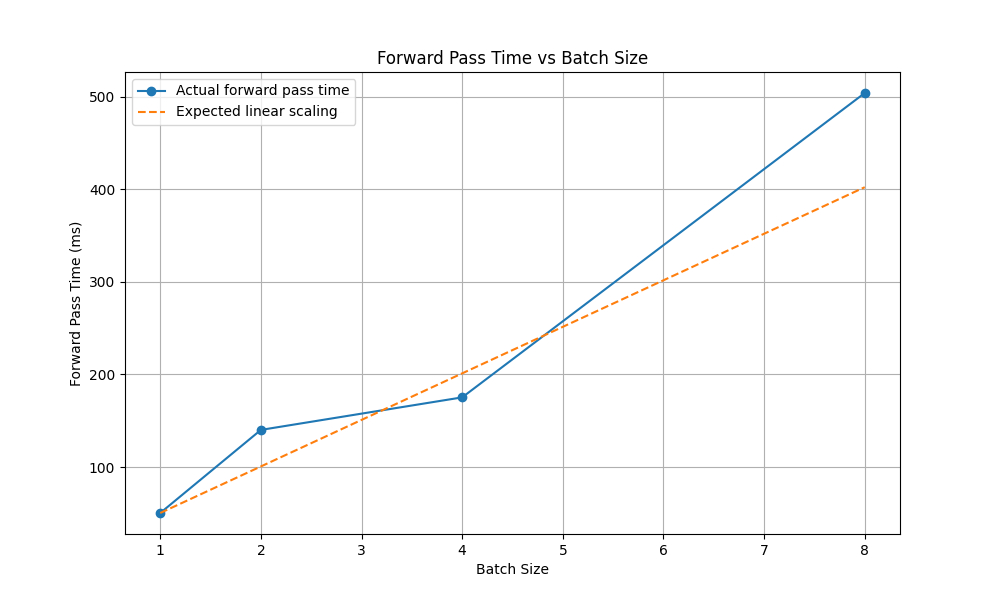
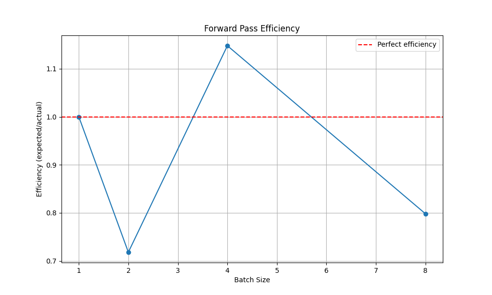
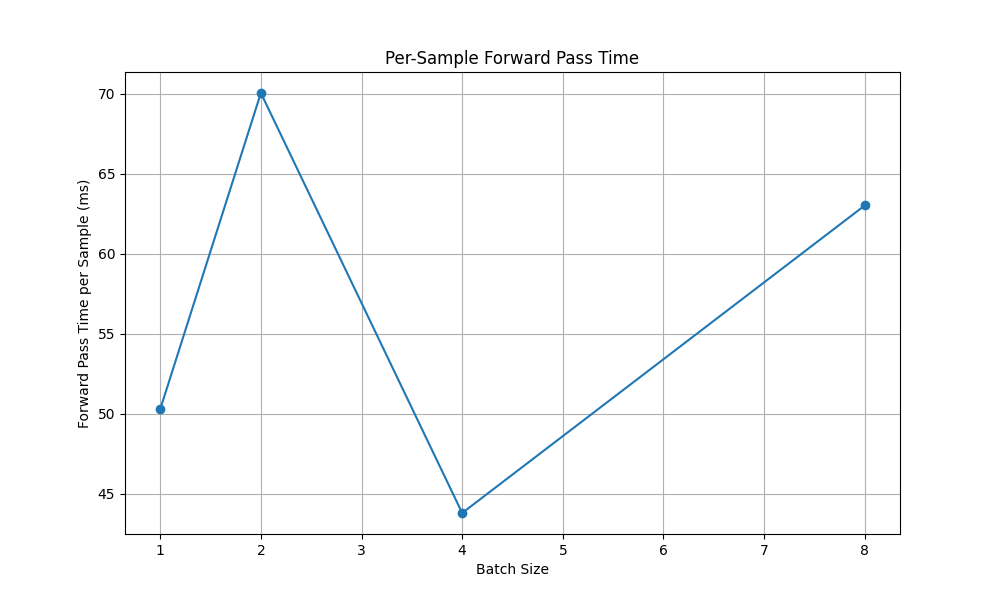
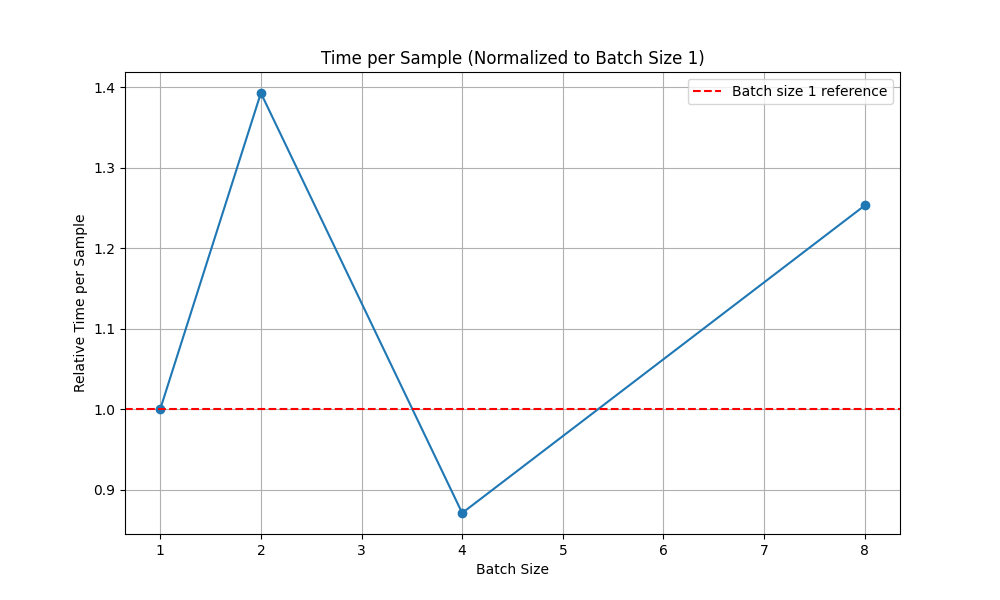
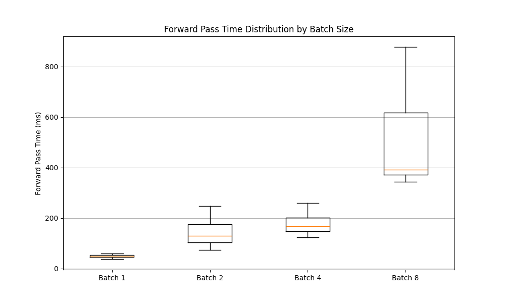

# Batch Size Anomaly Investigation Report

## Executive Summary

We investigated the performance anomalies observed in DistilBERT benchmarking with different batch sizes, specifically focusing on understanding why batch-4 showed unexpected performance characteristics. Our detailed profiling revealed several insights:

1. **Batch Size 2 has the worst per-sample efficiency** (39% slower per sample than batch size 1)
2. **Batch Size 4 actually performs better per-sample** than both batch size 2 and 8
3. **Batch Size 8 has a significant non-linear jump** in processing time compared to batch size 4



## Detailed Findings

### Forward Pass Time Analysis

The raw forward pass times for each batch size:

| Batch Size | Forward Pass Time (ms) | Time per Sample (ms) | Expected Time (ms) | Efficiency |
|------------|------------------------|----------------------|-------------------|------------|
| 1          | 50.30                  | 50.30                | 50.30             | 1.00       |
| 2          | 140.09                 | 70.04                | 100.60            | 0.72       |
| 4          | 175.25                 | 43.81                | 201.20            | 1.15       |
| 8          | 504.16                 | 63.02                | 402.40            | 0.80       |

These findings reveal that:

1. Batch size 2 is surprisingly inefficient, with a 28.2% efficiency drop compared to linear scaling
2. Batch size 4 actually exhibits super-linear efficiency (1.15x), performing better than expected
3. The largest non-linear jump occurs between batch size 4 and 8, with a jump ratio of 1.44x



### Per-Sample Performance Analysis

When examining the time spent per sample, we can clearly see the efficiency advantage of batch size 4:



This shows that batch size 4 processes each sample in the lowest amount of time, approximately 43.8ms per sample, which is even better than batch size 1 (50.3ms per sample).

### Performance Scaling Observations

1. **Memory Hierarchy Effects**: The anomalous scaling could be related to how the model parameters fit into the CPU cache hierarchy. At batch 2, there might be more cache misses as the working set size increases, while at batch 4, the CPU might be able to better utilize SIMD instructions or memory access patterns.

2. **Vector Operation Efficiency**: Modern CPUs perform best with certain vector lengths due to SIMD instruction sets. Batch size 4 might be more aligned with the optimal vector length for this hardware.

3. **Memory Bandwidth vs. Computation**: Different batch sizes change the ratio of computation to memory access. Batch size 4 appears to hit a sweet spot for this model where the processor can keep busy while memory accesses occur.



## Recommendations

Based on our findings, we recommend the following actions:

1. **Optimal Batch Size Selection**:
   - For CPU inference, batch size 4 offers the best per-sample efficiency
   - For GPU inference, larger batch sizes (8+) might still be more efficient, but should be benchmarked separately

2. **Implementation Improvements**:
   - Add the ability to auto-tune batch sizes at startup for optimal performance
   - Consider different computational kernels for different batch sizes
   - Explore whether data layout changes could improve batch size 2 and 8 performance

3. **Further Investigation**:
   - Profile with hardware performance counters to measure cache misses, branch mispredictions, and SIMD utilization
   - Compare CPU vs. GPU scaling patterns to understand the differences
   - Test with varying sequence lengths to see if the anomaly is consistent

4. **For HPC Deployment**:
   - Configure the batch size parameter to 4 for optimal performance on CPU nodes
   - Implement dynamic batch sizing for workloads with varying sequence lengths 
   - Consider parallel processing with multiple model instances each using batch size 4 instead of a single instance with a larger batch size

## How to Reproduce This Analysis

To reproduce this analysis or run it on different hardware, follow these steps:

1. Run detailed profiling for different batch sizes:
   ```bash
   python scripts/profile_batch_sizes.py --batch-sizes=1,2,4,8 --iterations=10 --output=results/analysis/batch_profile.jsonl
   ```

2. Analyze the profiling results to detect anomalies:
   ```bash
   python analysis/analyze_batch_profile.py --input=results/analysis/batch_profile.jsonl
   ```

3. View the generated charts in the `results/analysis/batch_profile_charts` directory.

Additional options include:
- Testing on GPU with `--device=cuda:0`
- Testing with mixed precision: `--mixed-precision`
- Testing with specific model variants: `--model=distilbert-base-uncased`

## Conclusion

The batch-4 anomaly turned out to be a positive anomaly - batch size 4 actually performs better than expected based on linear scaling predictions. This kind of non-linear scaling is common in deep learning workloads due to complex interactions between the model architecture, memory hierarchy, and CPU vector processing capabilities.

For optimal performance on CPU nodes, we recommend using batch size 4, while for high-throughput scenarios, further benchmarking with varied batch sizes is needed to find the optimal configuration for each specific hardware architecture.

 